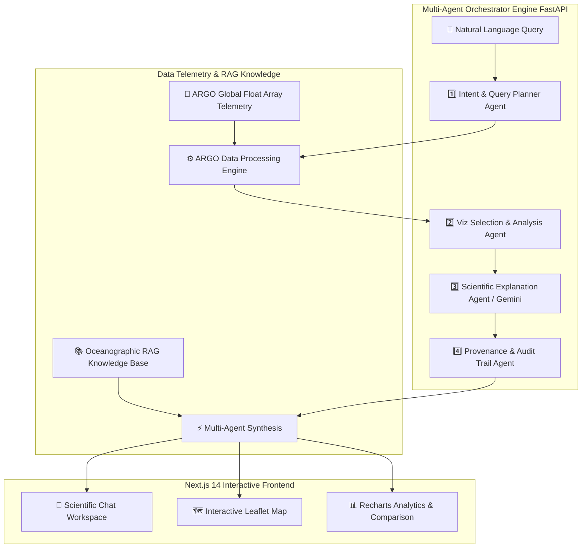

# 🌊 FLOATX — Agentic Ocean Intelligence Platform

[](https://nextjs.org/)
[](https://react.dev/)
[](https://www.typescriptlang.org/)
[](https://www.python.org/)
[](https://fastapi.tiangolo.com/)
[](https://tailwindcss.com/)
[](https://deepmind.google/technologies/gemini/)

> **FLOATX** is a state-of-the-art multi-agent ocean intelligence platform and conversational scientific workspace developed for **Smart India Hackathon (Problem Statement SIH25040 - Ministry of Earth Sciences / INCOIS)**. It empowers oceanographers, climate researchers, and policy analysts to query, analyze, and visualize complex **ARGO profiling float oceanographic telemetry** (temperature, salinity, pressure, and depth profiles) using natural language and grounded RAG reasoning.

---

## 🌟 Core Capabilities

* 🤖 **Autonomous Multi-Agent Intelligence**:
  * 6 specialized agents collaborate to process natural language questions into structured spatial, temporal, and depth parameters.
  * Real-time reasoning steps transparency panel showing live query decomposition and data audit.
* 🌊 **ARGO Telemetry & Profiling Float Engine**:
  * High-precision filtering of physical oceanographic measurements across the **Arabian Sea**, **Bay of Bengal**, **Equatorial Indian Ocean**, and coastal zones.
  * Vertical depth profile profiling from surface (0m) to bathypelagic depths (2000m+).
* 📊 **Dynamic Data Visualizations**:
  * Recharts-driven vertical profile charts (Thermocline & Halocline dynamics).
  * Multi-year time-series trend tracking and regional hydrographic comparison dashboards.
* 🗺️ **Interactive GIS Ocean Map**:
  * Geospatial Leaflet map rendering active profiling float deployments, trajectory paths, and float metadata.
  * Slide-over float profile drawer for instant observational telemetry inspection.
* 🧠 **RAG Ocean Domain Knowledge Base**:
  * Grounded scientific context retrieval for phenomena such as *Arabian Sea High Salinity Water (ASHSW)*, *Bay of Bengal Freshwater Lenses*, and *Monsoonal Upwelling*.
* 🎨 **Luxury Glassmorphic UI/UX**:
  * Sleek dark-mode interface built with Next.js 14, Framer Motion micro-animations, Lucide iconography, and presentation mode toggle.

---

## 🏗️ System Architecture



---

## ⚡ Multi-Agent Pipeline

| Agent Step | Name | Role & Output |
| :--- | :--- | :--- |
| **Step 1** | 🎯 **Intent & Planner Agent** | Parses spatial boundaries, depth ranges ($0\text{m} - 2000\text{m}$), temporal bounds, and target variables (Temperature / Salinity). |
| **Step 2** | 🔍 **Data Discovery Agent** | Queries physical ARGO profiling float observations deterministically via Pandas & NumPy. |
| **Step 3** | 📊 **Viz Selection Agent** | Selects optimal chart view (`DEPTH_PROFILE_CHART`, `COMPARISON_DASHBOARD`, `TIME_SERIES_CHART`, `OCEAN_MAP`). |
| **Step 4** | 🔬 **Scientific Explanation Agent** | Synthesizes grounded insights powered by **Google Gemini 1.5 Flash** or deterministic oceanographic physics. |
| **Step 5** | 🛡️ **Provenance & Audit Agent** | Computes confidence score, data quality validation ($98.2\%+$ completeness), and query execution metrics. |
| **Step 6** | 📖 **RAG Domain Lookup** | Attaches scientific context explaining physical mechanisms behind observed anomalies. |

---

## 🛠️ Technology Stack

| Category | Technologies |
| :--- | :--- |
| **Frontend Framework** | [Next.js 14](https://nextjs.org/) (App Router), [React 18](https://react.dev/), [TypeScript](https://www.typescriptlang.org/) |
| **Styling & UI** | [Tailwind CSS](https://tailwindcss.com/), [Framer Motion](https://www.framer.com/motion/), [Lucide Icons](https://lucide.dev/) |
| **Geospatial & Viz** | [Leaflet](https://leafletjs.com/), [Recharts](https://recharts.org/) |
| **Backend API** | [FastAPI](https://fastapi.tiangolo.com/), [Uvicorn](https://www.uvicorn.org/), [Pydantic v2](https://docs.pydantic.dev/) |
| **AI & Multi-Agent** | [Google Gemini 1.5 Flash](https://deepmind.google/technologies/gemini/), Custom Multi-Agent Orchestrator Engine |
| **Data & Spatial Science**| [Pandas](https://pandas.pydata.org/), [NumPy](https://numpy.org/), [Shapely](https://shapely.readthedocs.io/) |

---

## 📁 Repository Structure

```
d:\sih\
├── 📂 backend/                   # FastAPI Multi-Agent Engine
│   ├── 📂 agents/                # Multi-agent orchestrator & pipeline logic
│   │   └── orchestrator.py
│   ├── 📂 api/                   # API routes and data contracts
│   │   └── routes.py
│   ├── 📂 data/                  # ARGO telemetry data engine & GIS geometries
│   │   └── argo_engine.py
│   ├── 📂 rag/                   # Oceanographic domain knowledge store
│   │   └── ocean_knowledge.py
│   ├── main.py                   # FastAPI server entry point
│   └── requirements.txt          # Python dependencies
│
└── 📂 frontend/                  # Next.js 14 Web Application
    ├── 📂 app/                   # App Router pages (/ask, /map, /insights, /data, /saved)
    ├── 📂 components/            # Reusable UI components, Map, & Recharts
    ├── package.json              # Node dependencies & scripts
    ├── tailwind.config.js        # Tailwind CSS styling configuration
    └── tsconfig.json             # TypeScript configuration
```

---

## 🚀 Getting Started

### Prerequisites
* **Node.js**: `v18.0.0` or higher
* **Python**: `v3.10` or higher

### 1. Backend Setup (FastAPI Server)

```bash
# Navigate to backend directory
cd backend

# Install Python dependencies
pip install -r requirements.txt

# (Optional) Set your Gemini API Key
set GEMINI_API_KEY=your_gemini_api_key_here  # Windows Cmd
# or $env:GEMINI_API_KEY="your_gemini_api_key_here" # PowerShell

# Start FastAPI dev server on port 8000
python main.py
```
> The backend server will run at `http://localhost:8000` (API Docs available at `http://localhost:8000/docs`).

### 2. Frontend Setup (Next.js Application)

```bash
# Navigate to frontend directory
cd frontend

# Install Node dependencies
npm install

# Run development server on port 3000
npm run dev
```
> Open your browser and navigate to `http://localhost:3000` to interact with **FLOATX**.

---

<p center>
  Developed with ❤️ for <b>Smart India Hackathon (SIH)</b> — Ministry of Earth Sciences / INCOIS
</p>
